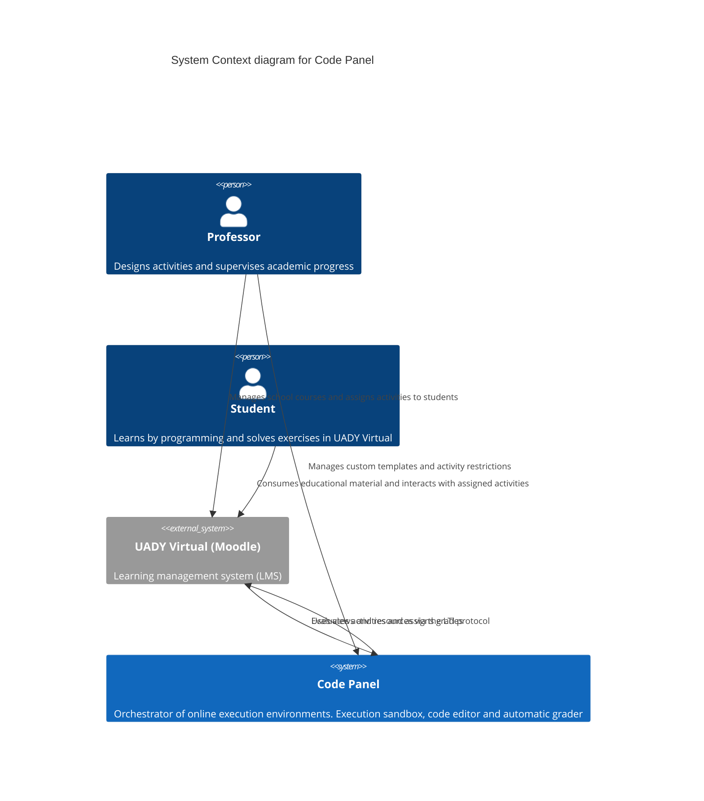

# C4 Model — Level 1: System Context

## Metadata

| Field              | Value                                                       |
| ------------------ | ----------------------------------------------------------- |
| **Document**       | C4 Model — Level 1 (System Context)                         |
| **Author**         | Code Panel — Development Team                               |
| **Reviewer**       | Carlos Coronado                                             |
| **Last review**    | 2026-09-06                                                  |
| **Status**         | Pending review                                              |
| **Source**         | `docs/temp/Diagrama C4 - Contenedores.drawio` (Nivel 1)     |
| **Technology**     | Mermaid `C4Context`                                         |

## Diagram

## Notes

- The **Professor** interacts with Code Panel directly (standalone access) and with UADY Virtual for course management; the **Student** only interacts through UADY Virtual.
- **UADY Virtual** is an external system (LMS based on Moodle) that consumes Code Panel views through the **LTI protocol** and receives grades back.
- The LTI link between UADY Virtual and Code Panel is bidirectional: UADY uses Code Panel views (`Rel_D`), and Code Panel returns evaluations and grades (`Rel_U`).
- The original diagram also documents a **non-LTI variant** (embed via `<iframe>` and grades exported as CSV), kept for reference in `docs/temp`.
- This diagram represents the system boundary: everything inside Code Panel is detailed in Level 2 (Container diagram).