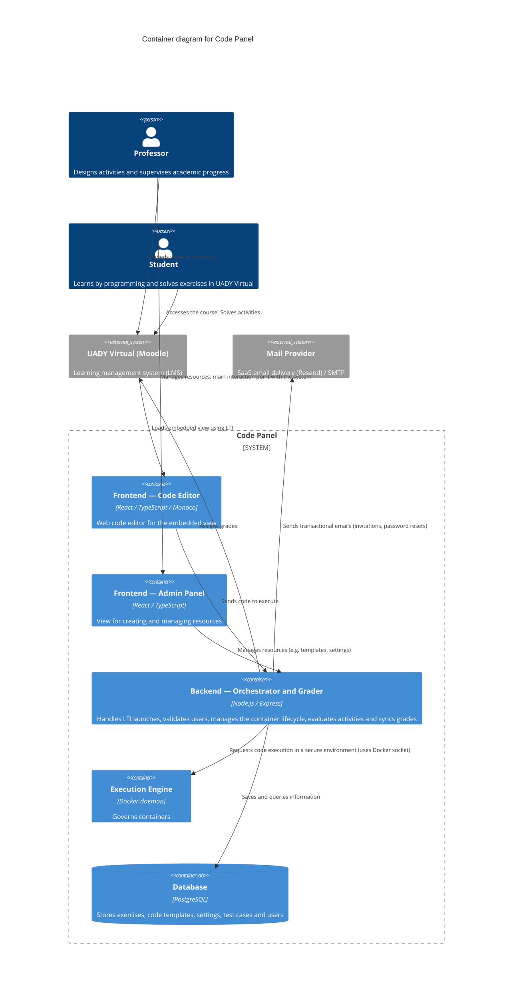

# C4 Model — Level 2: Container Diagram

## Metadata

| Field              | Value                                                       |
| ------------------ | ----------------------------------------------------------- |
| **Document**       | C4 Model — Level 2 (Container)                              |
| **Author**         | Code Panel — Development Team                               |
| **Reviewer**       | Carlos Coronado                                             |
| **Last review**    | 2026-09-06                                                  |
| **Status**         | Pending review                                              |
| **Source**         | `docs/temp/Diagrama C4 - Contenedores.drawio` (Nivel 2)     |
| **Technology**     | Mermaid `C4Container`                                       |

## Diagram

## Notes

- Containers match the original diagram: two **frontends** (code editor for the embedded view, admin panel for resource management), the **backend orchestrator and grader** (single entry point for the API), the **execution engine** and the **database**.
- The **Execution Engine** talks to the host Docker daemon through `/var/run/docker.sock` (mounted in `compose.prod.yaml`) to run untrusted student code in isolated, ephemeral containers with resource limits.
- The **Database** (PostgreSQL) is only reached through Prisma (no direct SQL in the API layer).
- **UADY Virtual** loads the code editor view through the **LTI protocol** and receives grades back from the backend.
- The **Mail Provider** is an external SaaS (Resend) or a configurable SMTP server, resolved at runtime by a strategy factory; it was not part of the original diagram but is part of the deployed system.
- The original diagram also documents a **non-LTI variant** (embed via `<iframe>` and grades exported as CSV), kept for reference in `docs/temp`.
- Component details (controllers, services, repositories) are out of scope for this level and belong to Level 3 (Component diagram).