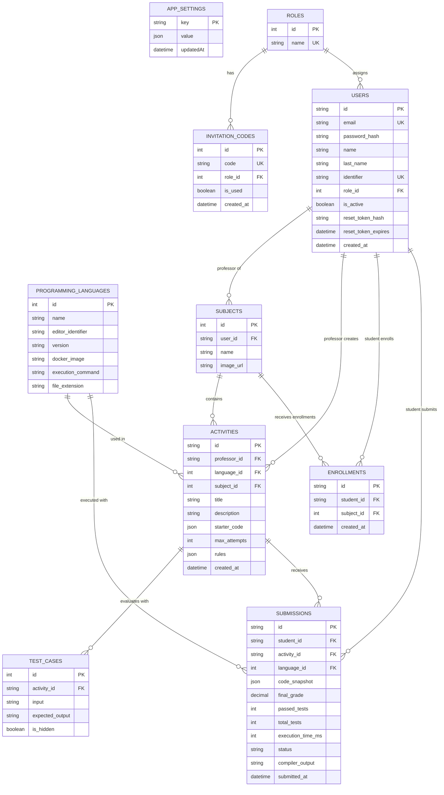

# Entity-Relationship Diagram

## Metadata

| Field                 | Value                                            |
| --------------------- | ------------------------------------------------ |
| **Document**          | Entity-Relationship Diagram (ERD)                |
| **Author**            | Code Panel — Development Team                    |
| **Reviewer**          | Carlos Coronado                                  |
| **Last review**       | 2026-09-06                                       |
| **Status**            | Pending review                                   |
| **Source**            | `prisma/schema.prisma`                           |
| **Database**          | PostgreSQL                                       |

## Diagram

## Notes

- `app_settings` is a standalone entity (global configuration) with no relationships.
- `users` participates in two roles: **professor** (relationship with `subjects` and `activities`) and **student** (relationship with `enrollments` and `submissions`).
- `enrollments` and `submissions` cascade on delete when the related user or activity is removed (`onDelete: Cascade` in the schema).
- `programming_languages` has a composite unique key on `(name, version)`.