# Use Case Diagram

## Metadata

| Field           | Value                                                                          |
| --------------- | ------------------------------------------------------------------------------ |
| **Document**    | Use Case Diagram                                                               |
| **Author**      | Code Panel — Development Team                                                  |
| **Reviewer**    | Carlos Coronado                                                                |
| **Last review** | 2026-09-06                                                                     |
| **Status**      | Pending review                                                                 |
| **Source**      | `prisma/schema.prisma` (roles), `docs/agents/02-api-reference.md`              |
| **Technology**  | Mermaid `flowchart` (UML-style)                                                |

## Diagram

```mermaid
flowchart LR
    A1["Guest"]:::actor
    A2["Student"]:::actor
    A3["Teacher"]:::actor
    A4["God (Admin)"]:::actor

    subgraph SG_AUTH["Auth"]
        UC1(("Register"))
        UC2(("Login"))
        UC3(("Refresh token"))
        UC4(("Forgot password"))
        UC5(("Reset password"))
    end
    subgraph SG_EXEC["Execution and Solving"]
        UC6(("Run code"))
        UC7(("View activity workspace"))
        UC8(("Submit solution"))
    end
    subgraph SG_ACCOUNT["Account"]
        UC9(("Manage own profile"))
        UC10(("Change password"))
    end
    subgraph SG_STUDENT["Student"]
        UC11(("Enroll in subject"))
        UC12(("View own submissions"))
    end
    subgraph SG_TEACHER["Teacher"]
        UC13(("Manage subjects"))
        UC14(("Manage activities"))
        UC15(("Manage test cases"))
        UC16(("View grades"))
        UC17(("Manage enrollments"))
    end
    subgraph SG_ADMIN["Administration"]
        UC18(("Manage invitations"))
        UC19(("Manage users"))
        UC20(("Manage programming languages"))
        UC21(("Manage app settings"))
    end

    A1 --> UC1
    A1 --> UC2
    A1 --> UC3
    A1 --> UC4
    A1 --> UC5
    A1 --> UC6
    A1 --> UC7
    A1 --> UC8

    A2 --> UC6
    A2 --> UC7
    A2 --> UC8
    A2 --> UC9
    A2 --> UC10
    A2 --> UC11
    A2 --> UC12

    A3 --> UC9
    A3 --> UC10
    A3 --> UC13
    A3 --> UC14
    A3 --> UC15
    A3 --> UC16
    A3 --> UC17

    A4 --> UC9
    A4 --> UC10
    A4 --> UC18
    A4 --> UC19
    A4 --> UC20
    A4 --> UC21

    UC8 -.->|include| UC6
    UC5 -.->|extend| UC2

    classDef actor fill:#08427b,color:#fff,stroke:#073b6f,stroke-width:2px
    classDef usecase fill:#f9f9f9,color:#333,stroke:#666,stroke-width:1.5px
    class A1,A2,A3,A4 actor
    class UC1,UC2,UC3,UC4,UC5,UC6,UC7,UC8,UC9,UC10,UC11,UC12,UC13,UC14,UC15,UC16,UC17,UC18,UC19,UC20,UC21 usecase
```

## Notes

- Actors are **flat** (no generalization between roles), per decision. **Guests (users without a session)** are treated as actors even though they are not a database role.
- Database roles (`prisma/schema.prisma`): **God**, **Student**, **Teacher**. Guests map to the public/optional-auth endpoints.
- `Submit solution` **includes** `Run code` (evaluation executes the code in the sandbox). `Reset password` **extends** `Login` (optional recovery path).
- Use cases map to the API reference in `docs/agents/02-api-reference.md` (auth, subjects, activities, test cases, submissions, grades, enrollments, invitations, languages, settings).